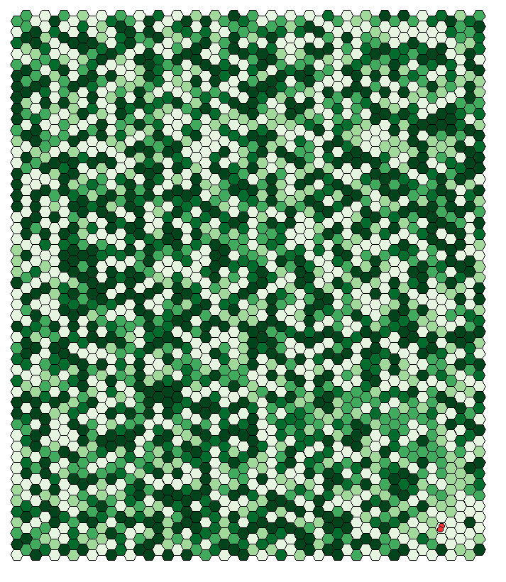
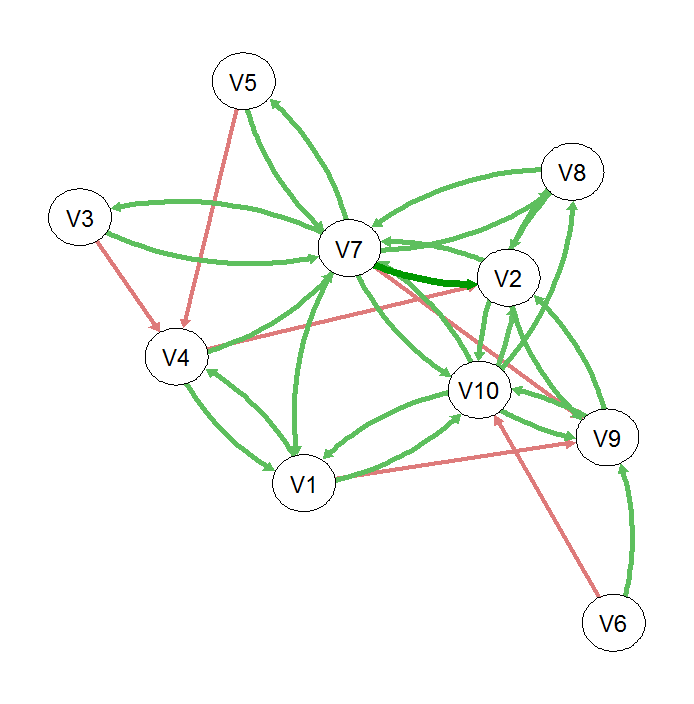

##Modeling the development of multilevel social structures##

Social animals show a great variety of structuring. The arrival at any one particular expression of social structure is thought to be through the interaction between species specific behavioural traits and environmental context in which the species is found. We use the simulation framework developed here to make predictions about the development of social structures under alternative behavioural and ecological contexts.

The simulations are based on a movement model proposed by Van Moorter et al (2009). In which individuals show movement bias for familiar sites. We extend this model to also allow for movement bias towards familiar individuals. By altering our assumptions about the growth/decay of familiarity towards landscape cells and individuals we produce predictions about the development of social structures.

###Parameters:###
* **The movement model requires four parameters:**
  + Weight of previous bearing on movement
  + Weight of landscape cells on movement
  + Weight of individuals on movement
  + Relative weight of familiar sites (i.e., how familiar is it?) Vs. valuable sites (i.e., amount food/distance)
  
* **The familiarization model requires two parameters:**
  + Growth/Decay of familiarization towards individuals
  + Decay of familiarization towards landscape cells (maximum familiarization of a cell when an individual is within the cell)
  
###Model visual###
* Below is a few examples of model runs:

  + Individuals quickly develop familiarization for both cells and individuals, producing small groups and small home ranges.  

  + Individuals develop familiarization for only individuals, producing large groups and no consistent home range.  

  + After a while...  

  

###Model outputs###
* The output from the model is an association matrix capturing the familarization between individuals. Note: this example was taken from the last of the above simulations, where all individuals formed one group. Negative weights are present as all individuals are initially assigned negative weights (i.e., avoid unfamiliar individuals).

  

