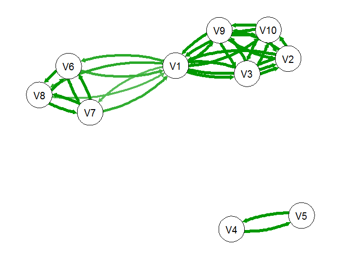

Development of social structures
================
Tyler Bonnell
April 26, 2017

Modeling the development of multilevel social structures
--------------------------------------------------------

Social animals show a great variety of structuring. The arrival at any one particular expression of social structure is thought to be through the interaction between species specific behavioural traits and environmental context in which the species is found. We use the simulation framework developed here to make predictions about the development of social structures under alternative behavioural and ecological contexts.

The simulations are based on a movement model proposed by Van Moorter et al (2009). In which individuals show movement bias for familiar sites. We extend this model to also allow for movement bias towards familiar individuals. By altering our assumptions about the growth/decay of familiarity towards landscape cells and individuals we produce predictions about the development of social structures.

### Parameters:

-   **The movement model requires four parameters:**
    -   Weight of previous bearing on movement
    -   Weight of landscape cells on movement
    -   Weight of individuals on movement
    -   Relative weight of familiar sites (i.e., how familiar is it?) Vs. valuable sites (i.e., amount food/distance)
-   **The familiarization model requires two parameters:**
    -   Growth/Decay of familiarization towards individuals
    -   Growth/Decay of familiarization towards landscape cells

### Model visual

Below is a few examples of model runs:

-   Individuals with no familiarization for either cells or individuals, producing wide ranging and randomly spatially associating with other individuals.
    

-   Individuals develop familiarization for cells only, producing home range like behaviour.
    

-   Individuals develop familiarization only for individuals, producing larger groups based on random spatial associations.
    

### Model outputs

-   The output from the model is an association matrix capturing the familarization between individuals. Note: this example network was taken for the case where individuals develop familiarization with others (last example from above) resulting in three groups, where two group are linked by individual 'V1'.

